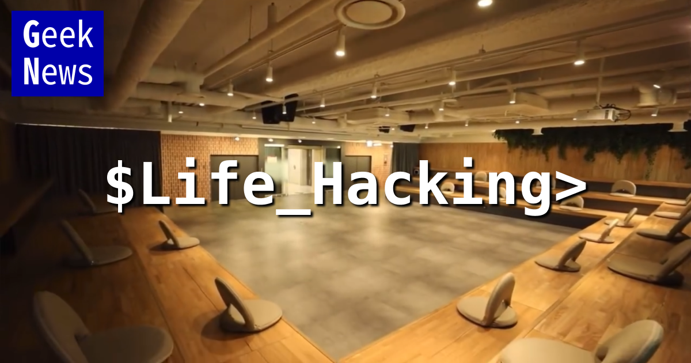

# GeekNight - "라이프 해킹 - 즐거운 삶을 위하여"

**긱나잇**은 긱뉴스 사용자들을 위한 밋업입니다.

- 사이드 프로젝트나 새로운 비즈니스를 하거나 또는 내 삶을 풍요롭게 하는 수많은 것들을 공유합니다.
- 남의 경험도 듣고, 새로운 아이디어도 공유하고, 다양한 의견을 가진 사람들이 교류하는 자리를 지향합니다.
- 기술에 익숙하지만, 그 기술 자체보다는 기술을 깊이 활용한 것들을 얘기하고 싶습니다.

# 지난 행사들

## 1st - "[GeekNight 2024](geeknight-2024.html)"
- 일시 : 12월 12일 저녁 7:00 ~
- 장소 : 서울 마포구 공덕동 마포T타운 5층 해피홀
- 내용 : 긱뉴스 이야기 + 라이트닝 토크 + 네트워킹
- 라이트닝 토크 리스트
  - 주식은 로봇이 해주고, 저는 놀고만 싶습니다 - dsp
  - 인지과학 연구로 증명된 학습 보조 도구 Anki: 10배 더 효과적으로 활용하는 방법 - 배휘동
  - Notion에서 Google Docs로 돌아가는 이야기 - 김수빈
  - GTD와 Inbox 그리고 생산성 시스템의 함정 (부제: 우리 모두는 J가 될 수 없다.) - 데이브
  - 5분이면 저보다 창업 잘하는 개발자가 됩니다: 개발자 대표 창업기 - nurinamu
  - 50대 개발자들의 커리어 해킹: 임원, 괴수, 스타트업 그리고 새로운 출발점 - 524
  - 신생 개발팀의 AI 기술 활용법: 생성형 AI와 함께 성장하기 - popenaga
  - 테니스에 미친 개발자가 테니스 다이어리 앱을 만들기까지 - 박시형
  - Cursor와 Expo로 고통없이 앱 만들기 - sungchi
  - 5년 동안 집에서 서버를 운영한 썰 - K리그 프로그래머
  - 운영비 0원, 글로벌 수익형 AI 서비스 제작기 - 조코딩
